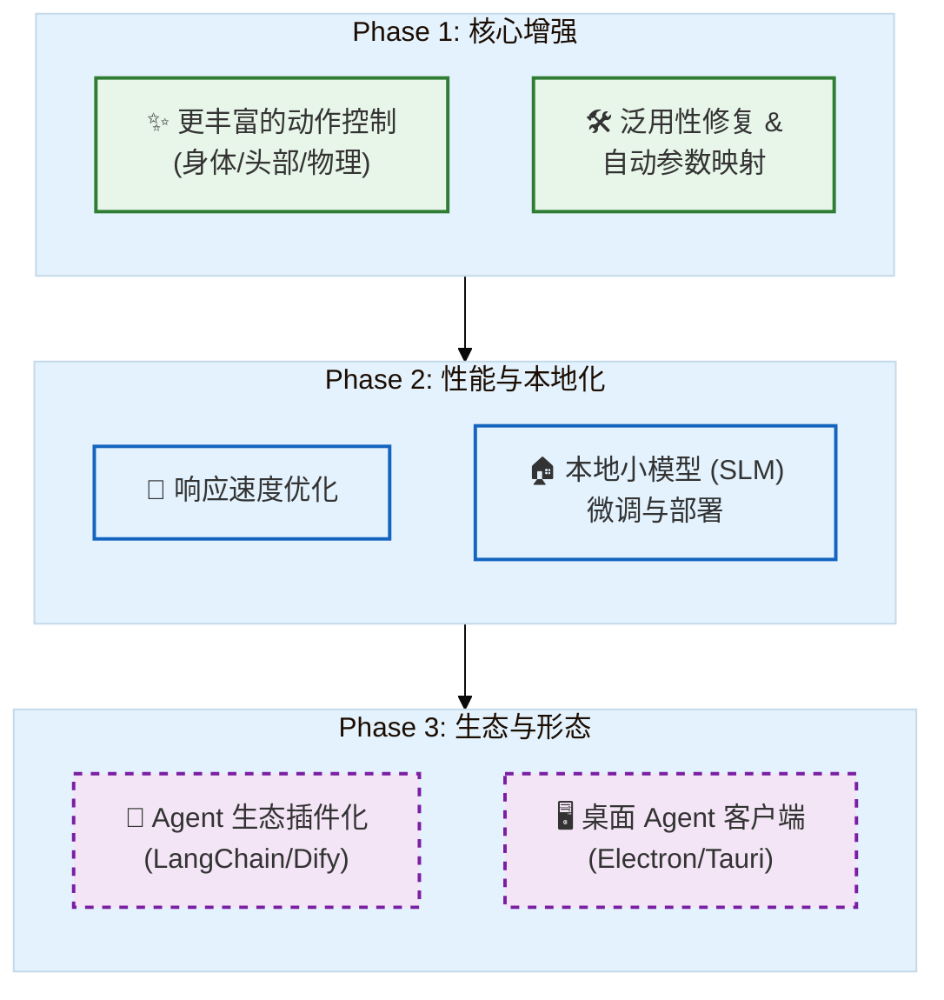

# SoulLink_Live2D

>  LLM 驱动的 Live2D 表情控制系统

SoulLink_Live2D 是一个创新的项目，它不通过程序直接使用注册的motions，而是通过大语言模型（LLM）理解对话内容和情感，实时控制 Live2D 虚拟形象的表情/动作变化，让数字人更加生动自然。

  

## 特性

-  **AI 驱动表情** - 通过 LLM 理解文本情感，自动生成表情参数
-  **实时对话** - 支持与 AI 实时对话，表情同步反应
-  **多模型支持** - 自动扫描并加载多个 Live2D 模型
-  **平滑过渡** - 表情参数平滑动画过渡，效果自然
-  **可视化控制** - 提供参数滑块，手动微调表情
-  **WebSocket 通信** - 前后端实时双向通信
-  **统一配置** - 所有设置集中在 `config.yaml`

## 预览


https://github.com/user-attachments/assets/d09a83d0-1f92-4cd8-b53c-e6204f7521e2


## 💎 专属 API 服务支持（推荐）

为了方便开发者快速跑通项目，**本项目提供了专属的高速 API 中转服务**。无需折腾网络环境或申请海外信用卡，直接注册账号配置即可使用。

* **服务地址**: `http://115.190.234.39:3000`
###  我们的优势:
*  **价格低廉**：极低延迟，针对 Live2D 实时流式响应优化
*  **全模型支持**：聚合 claude-opus-4-5，gemini-3-pro 等前沿模型，为本项目专门提供了低延迟的 gemini-2.5-flash-lite 模型支持，最大程度提升LLM表情控制的速度与质量
*  **稳定兼容**：完全兼容 OpenAI 等供应商的接口格式


> *加入项目交流群免费领取体验余额（见底部）。*

## 快速开始

### 环境要求

- Python 3.8+
- 现代浏览器（Chrome/Edge/Firefox）
- LLM API（OpenAI / DeepSeek / Ollama 等）

### 安装步骤

1. **克隆项目**
```bash
git clone https://github.com/your-repo/SoulLink_Live2D.git
cd SoulLink_Live2D
```

2. **安装依赖**
```bash
pip install -r requirements.txt
```

3. **配置 API Key**

编辑 `config.yaml`，设置你的 LLM API：

```yaml
llm:
  provider: openai
  apiKey: "your-api-key-here"
  baseUrl: "https://api.openai.com/v1"
  model: "gpt-4o-mini"
```

**支持的 API 服务：**
| 服务商 | baseUrl | 模型示例 |
|--------|---------|----------|
| OpenAI | https://api.openai.com/v1 | gpt-4o-mini, gpt-4o |
| DeepSeek | https://api.deepseek.com/v1 | deepseek-chat |
| SiliconFlow | https://api.siliconflow.cn/v1 | deepseek-ai/DeepSeek-V3 |
| Ollama（本地） | http://localhost:11434/v1 | llama2, mistral |

4. **放置 Live2D 模型**

将 Live2D Cubism 模型放入 `l2d/` 目录：
```
l2d/
├── your_model/
│   ├── your_model.model3.json  # 必需
│   ├── your_model.moc3         # 必需
│   ├── your_model.physics3.json
│   ├── textures/
│   └── motions/
```

5. **启动服务器**
```bash
python server.py
```

6. **打开浏览器**

访问 http://localhost:3000

## 📖 使用方法

### 方式一：对话面板

在左侧聊天面板输入消息，AI 会回复并同时做出表情反应。

### 方式二：浏览器控制台

```javascript
// 根据文本生成表情反应
reactTo("你今天真可爱！")

// 显示指定情感
showEmotion("开心")
showEmotion("害羞")
showEmotion("惊讶")

// 带情感的台词
speakWithEmotion("谢谢你的夸奖~", "害羞")

// 本地预设表情（无需 API）
applyLocalExpression("happy")
applyLocalExpression("shy")
applyLocalExpression("surprised")

// 重置表情
resetExpression()
```

### 方式三：直接调用 API

```javascript
// 完整控制
SoulLink.generateAndApplyExpression("收到一个礼物，非常惊喜", "生日派对场景")

// 手动设置参数
SoulLink.transitionToExpression({
    "ParamEyeLOpen": 1.0,
    "ParamEyeROpen": 1.0,
    "ParamMouthForm": 0.8
}, 500)
```

## ⚙️ 配置说明

`config.yaml` 完整配置：

```yaml
# 服务器配置
server:
  host: "0.0.0.0"
  port: 3000
  modelDirs:
    - "./l2d"

# LLM API 配置
llm:
  provider: openai
  apiKey: "your-api-key"
  baseUrl: "https://api.openai.com/v1"
  model: "gpt-4o-mini"
  temperature: 0.7      # 创造性（0-1）
  maxTokens: 500        # 最大 token 数

# 动画配置
animation:
  defaultDuration: 1000  # 过渡时间(ms)
  easing: "easeInOutCubic"
  autoResetDelay: 1500   # 自动重置延迟(ms)

# 界面配置
ui:
  showControlPanel: true
  showPhysicsParams: false
  defaultBackground: 0
```

## 项目结构

```
SoulLink_Live2D/
├── server.py           # Python 后端服务器
├── config.yaml         # 统一配置文件
├── index.html          # 前端页面
├── requirements.txt    # Python 依赖
├── js/
│   ├── main.js             # Live2D 加载与渲染
│   ├── llm-expression.js   # LLM 表情控制核心
│   ├── chat.js             # 聊天模块
│   ├── websocket-client.js # WebSocket 客户端
│   └── config-loader.js    # 配置加载器
├── l2d/                # Live2D 模型目录
├── background/         # 背景图片
├── models              # 其它可供测试的l2d模型
└── docs/
    └── LLM_EXPRESSION_PRINCIPLE.md  # 原理说明
```

## 🔧 API 参考

### SoulLink 对象

| 方法 | 说明 |
|------|------|
| `reactTo(text)` | 根据文本生成反应表情 |
| `showEmotion(emotion)` | 显示指定情感 |
| `speakWithEmotion(text, emotion)` | 带情感说话 |
| `applyLocalExpression(name)` | 应用本地预设表情 |
| `transitionToExpression(params, duration)` | 过渡到指定参数 |
| `resetToDefault()` | 重置为默认表情 |

### 本地预设表情

- `happy` - 开心
- `sad` - 悲伤
- `angry` - 生气
- `surprised` - 惊讶
- `shy` - 害羞
- `thinking` - 思考
- `sleepy` - 困倦
- `wink` - 眨眼

##  常见问题

**Q: 表情变化不明显？**
A: 尝试降低 `temperature` 值（如 0.3），或在提示中强调"参数值要大"。

**Q: 支持 Cubism 2/3 模型吗？**
A: 目前仅支持 Cubism 4 (.model3.json)。

**Q: 如何添加新模型？**
A: 将模型文件夹放入 `l2d/` 目录，服务器会自动检测。

**Q: API 调用失败？**
A: 检查 `config.yaml` 中的 apiKey 和 baseUrl 是否正确。

##  开发计划


##  许可证

MIT License

## 致谢

- [Live2D Cubism SDK](https://www.live2d.com/)
- [pixi-live2d-display](https://github.com/guansss/pixi-live2d-display)
- [PixiJS](https://pixijs.com/)

## 技术原理

本项目不仅仅是简单的关键词匹配。关于 LLM 如何将自然语言映射为 Cubism 参数的详细原理，请参阅：

* [LLM_EXPRESSION_PRINCIPLE.md](https://www.google.com/search?q=docs/LLM_EXPRESSION_PRINCIPLE.md)

## 联系与支持

如果你对项目感兴趣，或需要 **API 中转站的使用权限**，欢迎通过以下方式联系：

* **Email**: [20241008398@stu.shzu.edu.cn](mailto:20241008398@stu.shzu.edu.cn)
* **Project Group**: 704578889 (LynngNAN的项目群)
* **API Service**: [http://115.190.234.39:3000](https://www.google.com/url?sa=E&source=gmail&q=http://115.190.234.39:3000)
