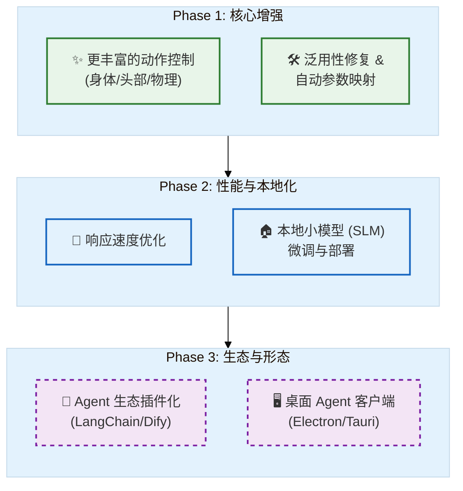

# SoulLink_Live2D

>  LLM 驱动的 Live2D 表情控制系统

SoulLink_Live2D 是一个创新的项目，它不通过程序直接使用注册的motions，而是通过大语言模型（LLM）理解对话内容和情感，实时控制 Live2D 虚拟形象的表情/动作变化，让数字人更加生动自然。

  

## 特性

-  **AI 驱动表情** - 通过 LLM 理解文本情感，自动生成表情参数
-  **实时对话** - 支持与 AI 实时对话，表情同步反应
-  **多模型支持** - 自动扫描并加载多个 Live2D 模型
-  **平滑过渡** - 表情参数平滑动画过渡，效果自然
-  **可视化控制** - 提供参数滑块，手动微调表情
-  **WebSocket 通信** - 前后端实时双向通信
-  **统一配置** - 所有设置集中在 `config.yaml`

## 本次更新内容

- 新增 TTS 播放期连续动作流：根据语音时长按秒生成动作帧，并通过缓动函数串联为完整动作序列。
- 新增口型联动：语音播放期间会同步嘴部开合，并与生成动作合并，避免参数冲突。
- 优化眼部与眨眼冲突处理：连续动作播放期间锁定眨眼，动作结束后恢复自动眨眼。
- 新增 `animation.eyeOpenBinary`：开启后眼部开合参数只取最小值或最大值。
- 新增 `animation.jointMotionBoost`：提高头部、手部、身体等关节参数的动作幅度。
- 优化 idle 协调：播放生成动作时中断 idle 动画，整段动作播放完成后再恢复 idle。
- 前端新增中英双语切换，支持 `ui.language` 配置为 `auto`、`zh`、`en`。

## 预览


https://github.com/user-attachments/assets/d09a83d0-1f92-4cd8-b53c-e6204f7521e2


## 快速开始

### 环境要求

- Python 3.8+
- 现代浏览器（Chrome/Edge/Firefox）
- LLM API（OpenAI / DeepSeek / Ollama 等）

### 安装步骤

1. **克隆项目**
```bash
git clone https://github.com/your-repo/SoulLink_Live2D.git
cd SoulLink_Live2D
```

2. **安装依赖**
```bash
pip install -r requirements.txt
```

3. **配置 API Key**

编辑 `config.yaml`，设置你的 LLM API：

```yaml
llm:
  provider: openai
  apiKey: "your-api-key-here"
  baseUrl: "https://api.openai.com/v1"
  model: "gpt-4o-mini"
```

**支持的 API 服务：**
| 服务商 | baseUrl | 模型示例 |
|--------|---------|----------|
| OpenAI | https://api.openai.com/v1 | gpt-4o-mini, gpt-4o |
| DeepSeek | https://api.deepseek.com/v1 | deepseek-chat |
| SiliconFlow | https://api.siliconflow.cn/v1 | deepseek-ai/DeepSeek-V3 |
| Ollama（本地） | http://localhost:11434/v1 | llama2, mistral |

4. **放置 Live2D 模型**

将 Live2D Cubism 模型放入 `l2d/` 目录：
```
l2d/
├── your_model/
│   ├── your_model.model3.json  # 必需
│   ├── your_model.moc3         # 必需
│   ├── your_model.physics3.json
│   ├── textures/
│   └── motions/
```

5. **启动服务器**
```bash
python server.py
```

6. **打开浏览器**

访问 http://localhost:3000

## 📖 使用方法

### 方式一：对话面板

在左侧聊天面板输入消息，AI 会回复并同时做出表情反应。

### 方式二：浏览器控制台

```javascript
// 根据文本生成表情反应
reactTo("你今天真可爱！")

// 显示指定情感
showEmotion("开心")
showEmotion("害羞")
showEmotion("惊讶")

// 带情感的台词
speakWithEmotion("谢谢你的夸奖~", "害羞")

// 本地预设表情（无需 API）
applyLocalExpression("happy")
applyLocalExpression("shy")
applyLocalExpression("surprised")

// 重置表情
resetExpression()
```

### 方式三：直接调用 API

```javascript
// 完整控制
SoulLink.generateAndApplyExpression("收到一个礼物，非常惊喜", "生日派对场景")

// 手动设置参数
SoulLink.transitionToExpression({
    "ParamEyeLOpen": 1.0,
    "ParamEyeROpen": 1.0,
    "ParamMouthForm": 0.8
}, 500)
```

## ⚙️ 配置说明

`config.yaml` 完整配置：

```yaml
# 服务器配置
server:
  host: "0.0.0.0"
  port: 3000
  modelDirs:
    - "./l2d"

# LLM API 配置
llm:
  provider: openai
  apiKey: "your-api-key"
  baseUrl: "https://api.openai.com/v1"
  model: "gpt-4o-mini"
  temperature: 0.7      # 创造性（0-1）
  maxTokens: 500        # 最大 token 数

# 动画配置
animation:
  defaultDuration: 1000  # 过渡时间(ms)
  easing: "easeInOutCubic"
  autoResetDelay: 1500   # 自动重置延迟(ms)

# 界面配置
ui:
  showControlPanel: true
  showPhysicsParams: false
  defaultBackground: 0
```

## 项目结构

```
SoulLink_Live2D/
├── server.py                   # Python 后端服务器
├── l2dagent.py                 # Live2D Agent 核心逻辑
├── config.yaml                 # 统一配置文件
├── requirements.txt            # Python 依赖
├── README.md                   # 项目说明文档
├── start.bat                   # Windows 启动脚本
│
├── frontend/                   # 前端页面文件夹
│   ├── index.html              # 前端主页面
│   ├── css/
│   │   └── styles.css          # 样式文件
│   └── js/
│       ├── components/         # 前端组件
│       ├── live2d/             # Live2D 集成
│       ├── services/           # 服务模块
│       └── utils/              # 工具函数
│
├── js/                         # 核心 JavaScript 文件
│   ├── main.js                 # Live2D 加载与渲染
│   ├── llm-expression.js       # LLM 表情控制核心
│   ├── chat.js                 # 聊天模块
│   ├── websocket-client.js     # WebSocket 客户端
│   └── config-loader.js        # 配置加载器
│
├── src/                        # Python 源代码
│   ├── __init__.py
│   ├── config/                 # 配置模块
│   ├── generators/             # 表情生成器
│   ├── models/                 # 数据模型
│   ├── server/                 # 服务器模块
│   └── utils/                  # 工具函数
│
├── l2d/                        # Live2D 默认模型目录
│   ├── shizuku.model3.json
│   ├── shizuku.moc3
│   ├── shizuku.physics3.json
│   ├── shizuku.pose3.json
│   ├── shizuku.cdi3.json
│   ├── motion/                 # 动作文件
│   └── shizuku.1024/           # 纹理资源
│
├── docs/                       # 文档
│   └── LLM_EXPRESSION_PRINCIPLE.md  # LLM 表情原理说明
│
├── static/                     # 静态资源
│   └── background/             # 背景图片
│
└── .gitignore                  # Git 忽略配置
```

### 关键目录说明

| 目录 | 说明 |
|------|------|
| `l2d/` | 默认 Live2D 模型，启动时自动加载 |
| `models/` | 其他可用的 Live2D 模型集合，可自由切换 |
| `src/` | Python 核心代码，包括 LLM 集成、表情生成等 |
| `frontend/` | 新版前端代码（组件化架构） |
| `core/` | 旧版核心实现，保留作参考 |
| `docs/` | 项目文档和原理说明 |
| `模型压缩包合集/` | 模型压缩包存储（`.gitignore` 忽略） |

## 🔧 API 参考

### SoulLink 对象

| 方法 | 说明 |
|------|------|
| `reactTo(text)` | 根据文本生成反应表情 |
| `showEmotion(emotion)` | 显示指定情感 |
| `speakWithEmotion(text, emotion)` | 带情感说话 |
| `applyLocalExpression(name)` | 应用本地预设表情 |
| `transitionToExpression(params, duration)` | 过渡到指定参数 |
| `resetToDefault()` | 重置为默认表情 |

### 本地预设表情

- `happy` - 开心
- `sad` - 悲伤
- `angry` - 生气
- `surprised` - 惊讶
- `shy` - 害羞
- `thinking` - 思考
- `sleepy` - 困倦
- `wink` - 眨眼

##  常见问题

**Q: 表情变化不明显？**
A: 尝试降低 `temperature` 值（如 0.3），或在提示中强调"参数值要大"。

**Q: 支持 Cubism 2/3 模型吗？**
A: 目前仅支持 Cubism 4 (.model3.json)。

**Q: 如何添加新模型？**
A: 将模型文件夹放入 `l2d/` 目录，服务器会自动检测。

**Q: API 调用失败？**
A: 检查 `config.yaml` 中的 apiKey 和 baseUrl 是否正确。

##  开发计划

```mermaid
%%{init: {'theme': 'base', 'themeVariables': { 'primaryColor': '#fff', 'edgeLabelBackground':'#fff', 'tertiaryColor': '#e3f2fd'}}}%%
graph TD
    %% 样式定义
    classDef phase1 fill:#e8f5e9,stroke:#2e7d32,stroke-width:2px;
    classDef phase2 fill:#e3f2fd,stroke:#1565c0,stroke-width:2px;
    classDef phase3 fill:#f3e5f5,stroke:#7b1fa2,stroke-width:2px,stroke-dasharray: 5 5;

    subgraph P1 [Phase 1: 核心增强]
        direction TB
        %% 修复：添加了双引号 "" 包裹文本
        Task1["✨ 更丰富的动作控制<br/>(身体/头部/物理)"]:::phase1
        Task2["🛠️ 泛用性修复 &<br/>自动参数映射"]:::phase1
    end

    subgraph P2 [Phase 2: 性能与本地化]
        direction TB
        Task3["🚀 响应速度优化"]:::phase2
        Task4["🏠 本地小模型 (SLM)<br/>微调与部署"]:::phase2
    end

    subgraph P3 [Phase 3: 生态与形态]
        direction TB
        Task5["🔌 Agent 生态插件化<br/>(LangChain/Dify)"]:::phase3
        Task6["🖥️ 桌面 Agent 客户端<br/>(Electron/Tauri)"]:::phase3
    end

    P1 --> P2 --> P3
```


## Star History

[](https://www.star-history.com/#nanlingyin/SoulLink_Live2D&Date)


## 致谢

- [Live2D Cubism SDK](https://www.live2d.com/)
- [pixi-live2d-display](https://github.com/guansss/pixi-live2d-display)
- [PixiJS](https://pixijs.com/)

## 技术原理

本项目不仅仅是简单的关键词匹配。关于 LLM 如何将自然语言映射为 Cubism 参数的详细原理，请参阅：

* [LLM_EXPRESSION_PRINCIPLE.md](https://www.google.com/search?q=docs/LLM_EXPRESSION_PRINCIPLE.md)

## 联系与支持

如果你对项目感兴趣，欢迎通过以下方式联系：
>*（需要长期合作或者个人/开源/企业项目的单独适配也欢迎联系我）*
* **Email**: [20241008398@stu.shzu.edu.cn](mailto:20241008398@stu.shzu.edu.cn)
* **Project Group**: 704578889 (LynngNAN的项目群)

##  许可证

MIT License
