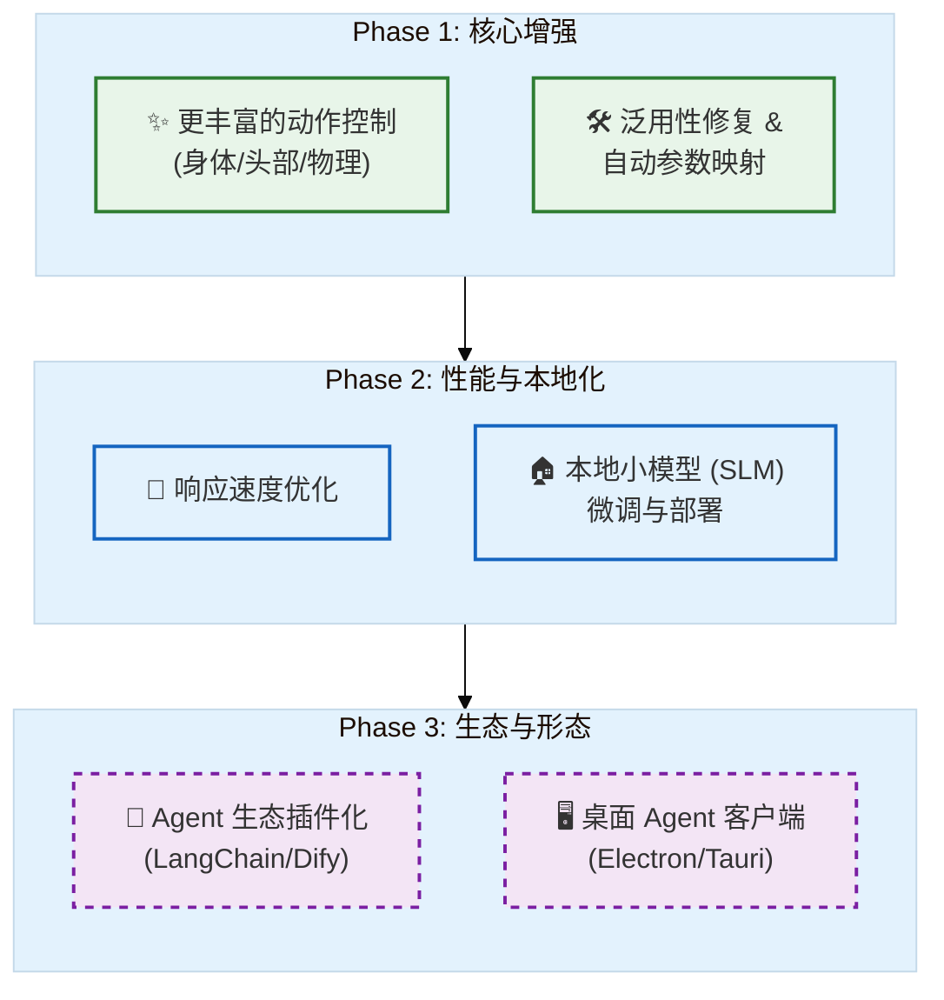
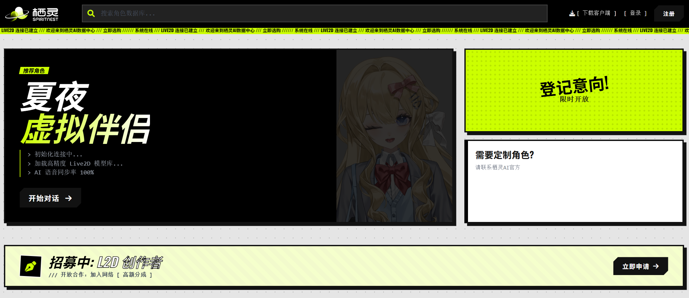
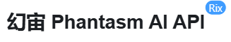

# SoulLink_Live2D

>  LLM 驱动的 Live2D 表情控制系统

SoulLink_Live2D 是一个创新的项目，它不通过程序直接使用注册的motions，而是通过大语言模型（LLM）理解对话内容和情感，实时控制 Live2D 虚拟形象的表情/动作变化，让数字人更加生动自然。

  

## 特性

-  **AI 驱动表情** - 通过 LLM 理解文本情感，自动生成 Live2D 表情参数
-  **实时对话** - 支持与 AI 实时对话，表情同步反应
-  **TTS 连续动作** - 语音播放期间按帧生成连贯动作序列，支持口型同步
-  **多模型支持** - 自动扫描并热加载多个 Live2D 模型，支持模型专属 Prompt
-  **遮罩系统** - 手动多边形蒙版 + AI 前景提取蒙版，实现模型与背景的遮挡效果
-  **环境光照** - 分析背景色温/亮度，自动调整模型色调融入场景
-  **平滑过渡** - 表情参数平滑动画过渡（easeInOutCubic），效果自然
-  **可视化控制** - 参数滑块、遮罩编辑器、光照调节面板
-  **WebSocket 通信** - 前后端实时双向通信
-  **统一配置** - 所有设置集中在 `config.yaml`，支持字段级继承
-  **中英双语** - 界面支持 `auto`、`zh`、`en` 语言切换

## 预览


https://github.com/user-attachments/assets/d09a83d0-1f92-4cd8-b53c-e6204f7521e2


## 快速开始

### 环境要求

- Python 3.8+
- Node.js 18+（前端开发）
- 现代浏览器（Chrome / Edge / Firefox）
- LLM API（OpenAI / DeepSeek / Claude / Ollama / SiliconFlow 等）

### 安装步骤

1. **克隆项目**
```bash
git clone https://github.com/nanlingyin/SoulLink_Live2D.git
cd SoulLink_Live2D
```
2. **安装后端依赖**
```bash
pip install -r requirements.txt
```

3. **配置**

复制示例配置并填入你的 API Key：
```bash
cp config.example.yaml config.yaml
```

编辑 `config.yaml`，至少配置 LLM API：
```yaml
llm:
  mode: api
  api:
    expression:
      provider: openai
      apiKey: "your-api-key-here"
      baseUrl: "https://api.openai.com/v1"
      model: "gpt-4o-mini"
    chat:
      provider: openai
      apiKey: "your-api-key-here"
      baseUrl: "https://api.openai.com/v1"
      model: "gpt-4o"
```

**支持的 LLM 服务：**

| 服务商 | provider | baseUrl | 模型示例 |
|--------|----------|---------|----------|
| OpenAI | `openai` | `https://api.openai.com/v1` | gpt-4o-mini, gpt-4o |
| DeepSeek | `deepseek` | `https://api.deepseek.com/v1` | deepseek-chat |
| Claude | `claude` | `https://api.anthropic.com/v1` | claude-sonnet-4-20250514 |
| SiliconFlow | `siliconflow` | `https://api.siliconflow.cn/v1` | deepseek-ai/DeepSeek-V3 |
| Ollama（本地） | `ollama` | `http://localhost:11434/v1` | llama2, mistral, qwen2.5 |
| 自定义 | `custom` | 你的 API 地址 | 兼容 OpenAI 格式的任意模型 |

> expression 和 chat 配置支持字段级继承——只需在子配置中覆盖需要修改的字段，其余自动继承 `llm.api` 的默认值。

4. **放置 Live2D 模型**

将 Cubism 4 模型放入 `l2d/` 目录（支持配置多个模型目录）：
```
l2d/
├── your_model.model3.json    # 必需 - 模型描述文件
├── your_model.moc3           # 必需 - 模型数据
├── your_model.cdi3.json      # 推荐 - 参数/部件名称定义
├── your_model.physics3.json  # 可选 - 物理模拟
├── your_model.pose3.json     # 可选 - 姿势
├── model_prompt.txt          # 可选 - 模型专属 LLM Prompt
├── textures/                 # 纹理资源
└── motions/                  # 动作文件
```

> 服务器启动后会自动扫描模型目录，运行期间新增/修改模型文件会通过 watchdog 热加载。

5. **启动**
```bash
# 终端 1：启动后端
python server.py

# 终端 2：启动前端
cd frontend-vue
npm install
npm run dev
```

6. **打开浏览器** 访问 http://localhost:5173

后端 API 默认运行在 `http://localhost:3000`（健康检查：`GET /api/health`）。

## 使用方法

### 对话面板

在左侧聊天面板输入消息，AI 会回复并同时做出表情反应。支持语音输入（浏览器 Web Speech API 或本地 Whisper）和 TTS 语音合成。

### 浏览器控制台

```javascript
// 根据文本生成表情反应
reactTo("你今天真可爱！")

// 显示指定情感
showEmotion("开心")
showEmotion("害羞")

// 带情感的台词（TTS + 表情 + 口型同步）
speakWithEmotion("谢谢你的夸奖~", "害羞")

// 本地预设表情（无需 API）
applyLocalExpression("happy")   // happy, sad, angry, surprised, shy, thinking, sleepy, wink

// 重置表情
resetExpression()
```

### 遮罩与光照

上传背景图后，可在控制面板中启用：

- **多边形蒙版** — 手动编辑节点定义遮挡区域，支持节点拖拽/增删、蒙版整体拖拽、自动边缘估计
- **AI 蒙版** — 调用 AI API 自动提取前景轮廓，生成灰度蒙版实现遮挡（需配置 `experimental.imageGen`）
- **环境光照** — 分析背景色温和亮度，通过 ColorMatrixFilter 自动调整模型色调

## 项目结构

```
SoulLink_Live2D/
├── server.py                       # 后端入口
├── config.yaml                     # 运行时配置（git 忽略）
├── config.example.yaml             # 配置模板
├── requirements.txt                # Python 依赖
│
├── src/                            # Python 后端源码
│   ├── config/                     #   配置管理（ConfigManager + 类型化 dataclass）
│   │   ├── manager.py              #     配置加载、字段级继承、前端安全导出
│   │   └── models.py               #     ServerConfig, LLMConfig, AnimationConfig 等
│   ├── server/                     #   aiohttp 异步服务器
│   │   ├── app.py                  #     应用初始化
│   │   ├── routes.py               #     HTTP/WebSocket 路由定义
│   │   └── handlers.py             #     WebSocket 消息处理
│   ├── generators/                 #   LLM 生成引擎
│   │   ├── expression.py           #     表情参数生成
│   │   ├── chat.py                 #     对话回复生成
│   │   ├── tts.py                  #     TTS 语音合成
│   │   └── local_expression.py     #     本地模型（Qwen2.5 + LoRA）
│   ├── models/                     #   Live2D 模型管理
│   │   ├── scanner.py              #     模型目录扫描
│   │   └── watcher.py              #     文件监控热加载（watchdog）
│   ├── asr/                        #   语音识别
│   │   └── whisper_asr.py          #     本地 Whisper ASR
│   └── utils/                      #   工具函数
│
├── frontend-vue/                   # Vue 3 前端（主入口）
│   ├── src/
│   │   ├── App.vue                 #   根组件
│   │   ├── components/
│   │   │   └── SettingsPage.vue    #   设置页面
│   │   ├── services/
│   │   │   ├── ws-client.js        #   WebSocket 客户端
│   │   │   └── legacy-loader.js    #   Legacy JS 模块加载器
│   │   └── styles.css              #   全局样式
│   ├── public/legacy/js/           #   复用的 Live2D 核心脚本
│   │   ├── live2d/                 #     渲染引擎层
│   │   │   ├── shared-state.js     #       全局状态声明
│   │   │   ├── model-loader.js     #       模型加载与初始化
│   │   │   ├── param-control.js    #       参数应用与覆盖
│   │   │   ├── control-panel.js    #       UI 控制面板生成
│   │   │   ├── background.js       #       背景上传/拖拽/控制
│   │   │   ├── occlusion-mask.js   #       多边形遮罩蒙版系统
│   │   │   ├── ai-mask.js          #       AI 前景提取蒙版
│   │   │   ├── ambient-lighting.js #       环境光照插件
│   │   │   ├── idle-motion.js      #       空闲动画调度
│   │   │   ├── interaction.js      #       拖拽/缩放/旋转交互
│   │   │   ├── helpers.js          #       工具函数
│   │   │   └── loader.js           #       主入口初始化
│   │   ├── services/               #     业务服务层
│   │   │   ├── config.js           #       配置加载
│   │   │   ├── expression.js       #       表情服务
│   │   │   ├── tts.js              #       TTS 服务
│   │   │   ├── asr.js              #       ASR 服务
│   │   │   ├── i18n.js             #       国际化
│   │   │   └── websocket.js        #       WebSocket 通信
│   │   ├── components/
│   │   │   └── chat-panel.js       #     聊天面板
│   │   └── utils/
│   │       └── prompt-builder.js   #     Prompt 构建
│   └── vite.config.js              #   Vite 配置（代理 /api, /ws, /l2d）
│
├── l2d/                            # Live2D 模型目录（默认）
├── docs/                           # 文档
├── static/                         # 静态资源
└── openspec/                       # OpenSpec 变更规范
```

## 架构

### 渲染层级

PIXI.js stage 通过 `zIndex` 分层渲染：

```
app.stage (sortableChildren: true)
  ├── bgSprite          (zIndex: -1)  — 背景图
  ├── modelContainer    (zIndex: 10)  — Live2D 模型容器
  ├── foregroundSprite  (zIndex: 20)  — 前景层（背景副本，被 mask 裁剪产生遮挡效果）
  ├── occlusionMask     (zIndex: 30)  — 蒙版图形（renderable=false）
  └── maskEditorLayer   (zIndex: 40)  — 节点手柄 / 轮廓线编辑器
```

### 数据流

**单次表情生成：**
用户输入 → WebSocket → 后端 LLM API → 表情参数 JSON → 验证/钳位 → 广播 → 前端平滑过渡 → 自动重置

**TTS 连续动作（两阶段）：**
1. 后端生成对话回复，按语音时长计算帧数（每 2s 一帧）
2. 规划阶段：LLM 生成每帧动作描述 → 参数阶段：LLM 转换为 Live2D 参数值
3. 前端逐帧调度，语音播放期间同步口型，播放结束恢复空闲动画

### HTTP API

| 方法 | 路径 | 说明 |
|------|------|------|
| `GET` | `/api/health` | 健康检查 |
| `GET` | `/api/models` | 获取可用模型列表 |
| `GET` | `/api/config` | 获取前端安全配置 |
| `GET` | `/api/config/full` | 获取完整配置（设置页面用） |
| `POST` | `/api/config/save` | 保存配置到 config.yaml |
| `POST` | `/api/tts` | TTS 语音合成 |
| `POST` | `/api/asr` | 本地 ASR 语音识别 |
| `POST` | `/api/extract-mask` | AI 蒙版提取（实验性） |
| `GET` | `/ws` | WebSocket 连接 |

### WebSocket 协议

**客户端 → 服务端：** `load_model`, `update_parameters`, `chat`, `chat_with_reply`, `expression`, `reset`, `tts_motion_start`, `tts_motion_stop`, `ping`

**服务端 → 客户端：** `model_list`, `load_model`, `expression`, `chat_reply`, `tts_motion_frame`, `tts_motion_end`, `parameters_updated`, `error`, `pong`

## 配置说明

所有配置集中在 `config.yaml`，完整模板见 `config.example.yaml`。

| 配置段 | 说明 |
|--------|------|
| `server` | 主机、端口、模型目录列表 |
| `llm.mode` | `api`（在线 API）或 `local`（本地 Qwen2.5 + LoRA） |
| `llm.api.expression` | 表情生成 LLM 配置（继承 `llm.api` 默认值） |
| `llm.api.chat` | 对话生成 LLM 配置（继承 `llm.api` 默认值） |
| `llm.local` | 本地模型路径、设备、温度 |
| `animation` | 过渡时长、缓动函数、自动重置延迟、眨眼/关节增强 |
| `model` | 模型目录、默认缩放 |
| `ui` | 控制面板显示、物理参数显示、默认背景、语言 |
| `voice.asr` | ASR 启用、模式（browser/local）、语言、自动发送 |
| `voice.tts` | TTS 启用、API 配置、语音、语速、口型同步强度 |
| `experimental.imageGen` | AI 蒙版提取用的图像生成 API 配置 |

## 常见问题

**Q: 表情变化不明显？**
A: 尝试降低 `temperature` 值（如 0.1），或使用 `model_prompt.txt` 定制参数规则强调参数幅度。

**Q: 支持 Cubism 2/3 模型吗？**
A: 目前仅支持 Cubism 4（`.model3.json` 格式）。

**Q: 如何添加新模型？**
A: 将模型文件夹放入 `l2d/` 目录（或 `server.modelDirs` 配置的任意目录），服务器会通过 watchdog 自动检测。

**Q: API 调用失败？**
A: 检查 `config.yaml` 中的 `apiKey` 和 `baseUrl` 是否正确。也可以在设置页面（右上角齿轮图标）中直接修改。

**Q: AI 蒙版提取不工作？**
A: 需要在 `config.yaml` 的 `experimental.imageGen` 中配置支持图像理解的模型 API（如 GPT-4o）。

**Q: 如何自定义模型的表情规则？**
A: 在模型目录下创建 `model_prompt.txt`，描述该模型的参数能力和动作规则，加载模型时会自动读取。

## 开发计划


```mermaid
%%{init: {'theme': 'base', 'themeVariables': { 'primaryColor': '#fff', 'edgeLabelBackground':'#fff', 'tertiaryColor': '#e3f2fd'}}}%%
graph TD
    classDef phase1 fill:#e8f5e9,stroke:#2e7d32,stroke-width:2px;
    classDef phase2 fill:#e3f2fd,stroke:#1565c0,stroke-width:2px;
    classDef phase3 fill:#f3e5f5,stroke:#7b1fa2,stroke-width:2px,stroke-dasharray: 5 5;

    subgraph P1 [Phase 1: 核心增强]
        direction TB
        Task1["✨ 更丰富的动作控制<br/>(身体/头部/物理)"]:::phase1
        Task2["🛠️ 泛用性修复 &<br/>自动参数映射"]:::phase1
    end

    subgraph P2 [Phase 2: 性能与本地化]
        direction TB
        Task3["🚀 响应速度优化"]:::phase2
        Task4["🏠 本地小模型 (SLM)<br/>微调与部署"]:::phase2
    end

    subgraph P3 [Phase 3: 生态与形态]
        direction TB
        Task5["🔌 Agent 生态插件化<br/>(LangChain/Dify)"]:::phase3
        Task6["🖥️ 桌面 Agent 客户端<br/>(Electron/Tauri)"]:::phase3
    end

    P1 --> P2 --> P3
```

## Star History

[](https://www.star-history.com/#nanlingyin/SoulLink_Live2D&Date)

## 致谢与赞助

### 特别感谢

本项目的开发得到了以下组织和项目的支持：

- **[栖灵 AI](https://www.spiritnest.ai/)** - 感谢栖灵 AI 对本项目开发过程的资金赞助支持

<div align="center">
  <a href="https://www.spiritnest.ai/">
    
  </a>
</div>

- **[幻宙 Phantasm AI](https://phapi.furina.chat/)** - 感谢幻宙 Phantasm AI 为本项目的开发提供 API 支持

<div align="center">
  <a href="https://phapi.furina.chat/">
    
  </a>
</div>

- **[my-neuro](https://github.com/morettt/my-neuro)** - 感谢 my-neuro 项目的开发者们为我提供的灵感

<div align="center">
  <a href="https://github.com/morettt/my-neuro">
    
  </a>
</div>

### 技术依赖

- [Live2D Cubism SDK](https://www.live2d.com/) - 官方 Live2D 运行时
- [pixi-live2d-display](https://github.com/guansss/pixi-live2d-display) v0.4.0 - Live2D 模型加载与渲染
- [PixiJS](https://pixijs.com/) v6.5.10 - 2D 渲染引擎
- [Vue 3](https://vuejs.org/) + [Vite](https://vitejs.dev/) - 前端框架
- [aiohttp](https://docs.aiohttp.org/) - Python 异步 HTTP/WebSocket 服务器

## 技术原理

关于 LLM 如何将自然语言映射为 Cubism 参数的详细原理，请参阅 [LLM_EXPRESSION_PRINCIPLE.md](docs/LLM_EXPRESSION_PRINCIPLE.md)。

## 联系与支持

如果你对项目感兴趣，欢迎通过以下方式联系：
>*（需要长期合作或者个人/开源/企业项目的单独适配也欢迎联系我）*
* **Email**: [20241008398@stu.shzu.edu.cn](mailto:20241008398@stu.shzu.edu.cn)
* **Project Group**: 704578889 (LynngNAN的项目群)

## 许可证

MIT License
