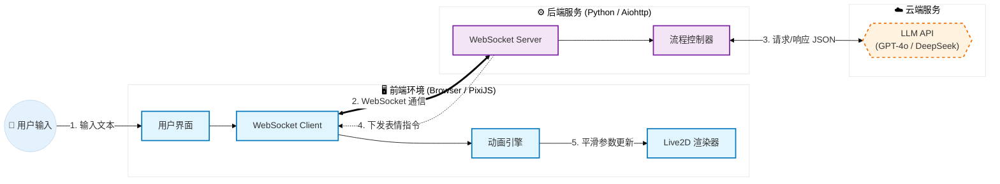
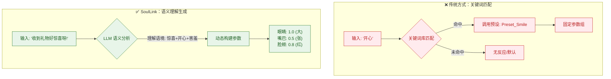
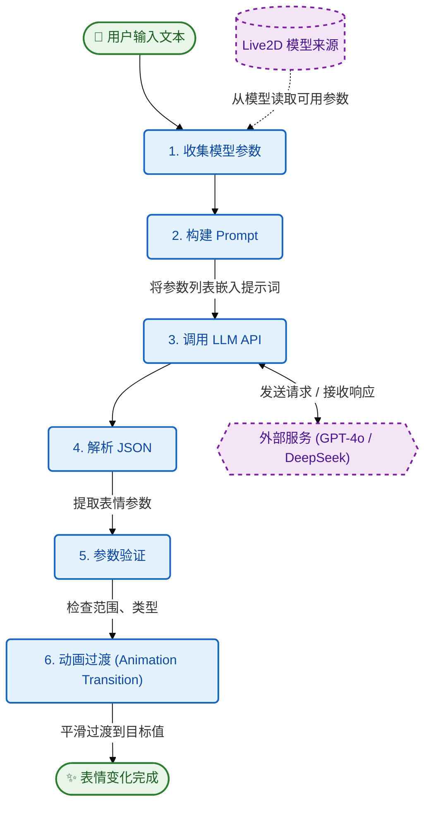
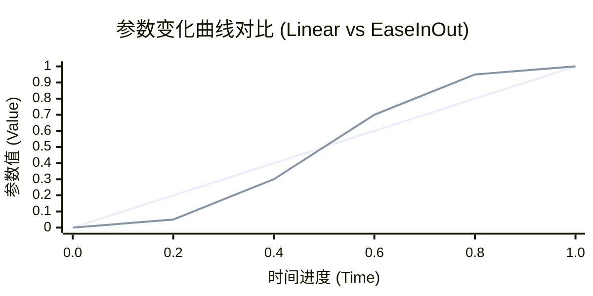

# LLM 表情控制原理说明

> 本文档详细解释 SoulLink_Live2D 如何通过大语言模型（LLM）实现 Live2D 表情的智能控制。

## 📋 目录

1. [系统架构](#系统架构)
2. [核心原理](#核心原理)
3. [工作流程](#工作流程)
4. [参数映射机制](#参数映射机制)
5. [Prompt 工程](#prompt-工程)
6. [动画过渡系统](#动画过渡系统)
7. [技术细节](#技术细节)

---

## 系统架构



### 组件说明

| 组件 | 技术栈 | 职责 |
|------|--------|------|
| 前端 | HTML + PixiJS + pixi-live2d-display | 渲染 Live2D 模型、处理用户交互 |
| 后端 | Python + aiohttp | WebSocket 服务、LLM API 调用 |
| 动画引擎 | JavaScript | 参数平滑过渡、缓动函数 |
| LLM | GPT-4o / DeepSeek 等 | 理解情感、生成表情参数 |

---

## 核心原理

### 1. 情感理解 → 参数生成

传统方式需要预定义表情，每个表情对应固定参数。SoulLink_Live2D 的创新在于：

**让 LLM 理解任意文本的情感，动态生成适合的表情参数。**



### 2. 为什么用 LLM？

| 方案 | 优点 | 缺点 |
|------|------|------|
| 关键词匹配 | 简单、快速 | 只能识别预定义词汇，无法理解语境 |
| 情感分析模型 | 专业、准确 | 只能分类情感，无法生成参数 |
| **LLM** | 理解语境、生成参数、支持任意输入 | 需要 API 调用、有延迟 |

LLM 的优势在于：
- 理解复杂语境（讽刺、隐喻等）
- 生成细腻的参数组合
- 零样本学习，无需训练

---

## 工作流程

### 完整流程图


### 步骤详解

#### Step 1: 收集模型参数

模型加载后，从 `.model3.json` 和 `.cdi3.json` 读取所有可用参数：

```javascript
// 示例：shizuku 模型的部分参数
{
  "ParamAngleX": { min: -30, max: 30, default: 0 },
  "ParamAngleY": { min: -30, max: 30, default: 0 },
  "ParamEyeLOpen": { min: 0, max: 1, default: 1 },
  "ParamEyeROpen": { min: 0, max: 1, default: 1 },
  "ParamMouthOpenY": { min: 0, max: 1, default: 0 },
  "ParamMouthForm": { min: -1, max: 1, default: 0 },
  "ParamBrowLY": { min: -1, max: 1, default: 0 },
  "ParamCheek": { min: 0, max: 1, default: 0 }
  // ...更多参数
}
```

#### Step 2: 构建 Prompt

将参数信息嵌入系统提示词，让 LLM 知道可以控制哪些参数：

```
系统提示词:
你是一个 Live2D 虚拟形象的表情控制器。

当前模型可用参数：
  - ParamEyeLOpen: 左眼睁开程度, 范围[0, 1]
  - ParamEyeROpen: 右眼睁开程度, 范围[0, 1]
  - ParamMouthOpenY: 嘴巴张开程度, 范围[0, 1]
  - ParamMouthForm: 嘴型 (-1=不开心, 1=微笑), 范围[-1, 1]
  - ParamBrowLY: 左眉位置 (-1=皱眉, 1=扬眉), 范围[-1, 1]
  - ParamCheek: 脸红程度, 范围[0, 1]
  ...

返回JSON格式：
{
  "expression": "表情描述",
  "parameters": { "参数ID": 数值, ... },
  "duration": 过渡时间毫秒数
}
```

#### Step 3: LLM 生成

用户输入："收到礼物好开心呀！"

LLM 返回：
```json
{
  "expression": "惊喜开心",
  "parameters": {
    "ParamEyeLOpen": 1.0,
    "ParamEyeROpen": 1.0,
    "ParamEyeLSmile": 0.6,
    "ParamEyeRSmile": 0.6,
    "ParamMouthOpenY": 0.4,
    "ParamMouthForm": 0.8,
    "ParamBrowLY": 0.5,
    "ParamBrowRY": 0.5,
    "ParamCheek": 0.7
  },
  "duration": 600
}
```

#### Step 4-5: 解析与验证

```javascript
// 提取 JSON
const jsonMatch = content.match(/\{[\s\S]*\}/);
const result = JSON.parse(jsonMatch[0]);

// 验证参数范围
for (const [paramId, value] of Object.entries(result.parameters)) {
    const info = AVAILABLE_PARAMETERS[paramId];
    if (info) {
        // 限制在有效范围内
        result.parameters[paramId] = Math.max(info.min, Math.min(info.max, value));
    }
}
```

#### Step 6: 动画过渡

使用缓动函数实现平滑过渡：

```javascript
function transitionToExpression(targetParams, duration) {
    const startParams = getCurrentParams();
    const startTime = performance.now();
    
    function animate(currentTime) {
        const progress = (currentTime - startTime) / duration;
        const easedProgress = easeInOutCubic(progress);
        
        for (const [param, target] of Object.entries(targetParams)) {
            const current = startParams[param] + (target - startParams[param]) * easedProgress;
            model.internalModel.coreModel.setParameterValueById(param, current);
        }
        
        if (progress < 1) requestAnimationFrame(animate);
    }
    
    requestAnimationFrame(animate);
}
```

---

## 参数映射机制

### Live2D 参数类型

| 类别 | 参数示例 | 作用 |
|------|----------|------|
| 眼睛 | ParamEyeLOpen, ParamEyeROpen | 眼睛睁开程度 |
| 眼睛表情 | ParamEyeLSmile, ParamEyeRSmile | 眯眼笑 |
| 眼球 | ParamEyeBallX, ParamEyeBallY | 视线方向 |
| 眉毛 | ParamBrowLY, ParamBrowRY | 眉毛高低 |
| 嘴巴 | ParamMouthOpenY, ParamMouthForm | 张嘴、嘴型 |
| 头部 | ParamAngleX/Y/Z | 头部角度 |
| 身体 | ParamBodyAngleX/Y/Z | 身体角度 |
| 特效 | ParamCheek | 脸红程度 |

### 通用参数映射

不同模型的参数命名可能不同，系统使用映射表兼容：

```javascript
const EXPRESSION_PARAM_MAPPING = {
    eyeOpenL: ['ParamEyeLOpen', 'ParamEyeL_Open', 'EyeLOpen'],
    eyeOpenR: ['ParamEyeROpen', 'ParamEyeR_Open', 'EyeROpen'],
    mouthOpen: ['ParamMouthOpenY', 'ParamMouth_OpenY', 'MouthOpenY'],
    // ...
};
```

---

## Prompt 工程

### 系统提示词设计原则

1. **明确角色**：定义 LLM 为"表情控制器"
2. **提供约束**：列出可用参数及范围
3. **规定格式**：要求返回标准 JSON
4. **强调效果**：提示参数值要够大

### 完整 Prompt 模板

```text
你是一个 Live2D 虚拟形象的表情控制器。根据场景、对话或情感描述，生成表情参数。

当前模型可用参数：
{动态生成的参数列表}

返回JSON格式：
{
  "expression": "表情描述",
  "parameters": {
    "参数ID": 数值,
    ...
  },
  "duration": 过渡时间毫秒数
}

要求：
1. 参数值要足够大，让表情变化明显可见
2. 充分组合多个参数来表达丰富表情
3. 眼睛、眉毛、嘴巴的配合对表情很重要
4. 只返回JSON，不要其他文字
```

### 不同场景的输入示例

| 场景 | 用户输入 | LLM 理解 |
|------|----------|----------|
| 对话反应 | "你真厉害！" | 开心、崇拜 |
| 情感描述 | "表现出害羞的样子" | 害羞、脸红 |
| 台词表演 | "（惊讶）什么？！" | 惊讶、眼睛睁大 |
| 场景设定 | "角色正在思考难题" | 思考、眉头微皱 |

---

## 动画过渡系统

### 缓动函数

系统内置多种缓动函数，使动画更自然：

```javascript
const easingFunctions = {
    linear: t => t,
    easeInQuad: t => t * t,
    easeOutQuad: t => t * (2 - t),
    easeInOutQuad: t => t < 0.5 ? 2*t*t : -1+(4-2*t)*t,
    easeInCubic: t => t * t * t,
    easeOutCubic: t => (--t) * t * t + 1,
    easeInOutCubic: t => t < 0.5 
        ? 4*t*t*t 
        : (t-1)*(2*t-2)*(2*t-2)+1,
    easeInOutSine: t => -(Math.cos(Math.PI * t) - 1) / 2
};
```

### 缓动效果对比



### 自动重置机制

表情变化后，可以设置自动重置：

```javascript
if (autoReset) {
    setTimeout(() => {
        resetToDefault(duration);
    }, autoResetDelay);
}
```

---

## 技术细节

### 参数过滤

排除物理模拟参数（头发、裙子等），避免干扰：

```javascript
function isPhysicsParam(paramId) {
    const physicsKeywords = [
        'Hair', 'Ribbon', 'Skirt', 'Bust', 'Sway',
        'Rotation_', 'Skinning', 'Breath'
    ];
    return physicsKeywords.some(keyword => paramId.includes(keyword));
}
```

### WebSocket 消息格式

```javascript
// 客户端 → 服务器：请求生成表情
{
    "type": "chat",
    "message": "你好呀！",
    "context": "初次见面场景",
    "autoReset": true
}

// 服务器 → 客户端：表情指令
{
    "type": "expression",
    "expression": "开心打招呼",
    "parameters": {
        "ParamEyeLOpen": 1.0,
        "ParamMouthForm": 0.8,
        "ParamCheek": 0.3
    },
    "duration": 800,
    "autoReset": true
}
```

### 并发处理

聊天回复和表情生成并行执行：

```python
# 并发调用
chat_task = self.chat_generator.generate(text, history)
expression_task = self.expression_generator.generate(text, context)

results = await asyncio.gather(chat_task, expression_task)
```

---

## 性能优化建议

1. **缓存常用表情**：对于高频情感（开心、悲伤等），缓存 LLM 结果
2. **本地预设兜底**：API 失败时使用本地预设表情
3. **降低 Temperature**：设为 0.1-0.3 可提高参数一致性
4. **批量更新参数**：减少 `setParameterValue` 调用次数

---

## 扩展方向

1. **语音情感分析**：通过语音识别 + 情感分析触发表情
2. **多模态输入**：结合视觉输入（用户表情镜像）
3. **表情学习**：记录用户偏好，个性化表情风格
4. **实时对话**：支持流式输出，边说话边变表情

---

## 参考资料

- [Live2D Cubism SDK 文档](https://docs.live2d.com/)
- [pixi-live2d-display](https://github.com/guansss/pixi-live2d-display)
- [OpenAI API 文档](https://platform.openai.com/docs)
